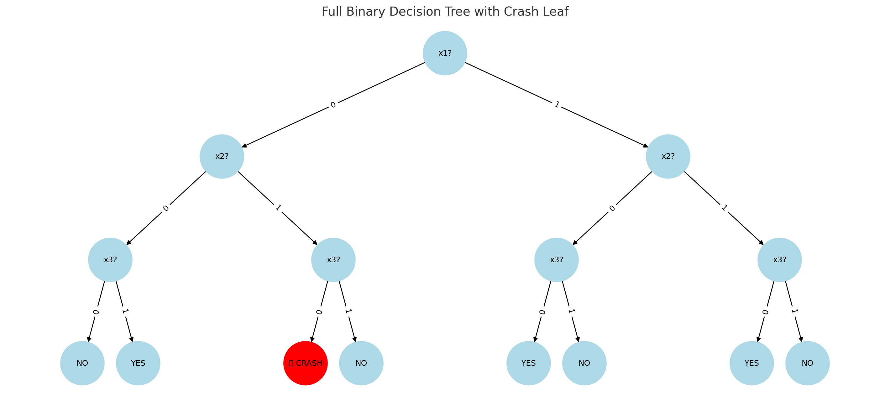
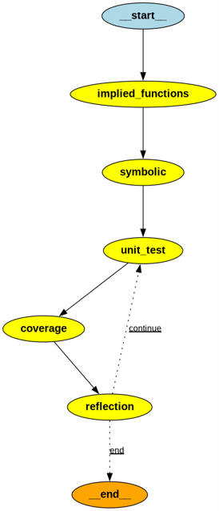

# Welcome to UnitTenX

In the Venture Beat article (https://venturebeat.com/ai/ai-can-fix-bugs-but-cant-find-them-openais-study-highlights-limits-of-llms-in-software-engineering/), 
Emilia David discusses that LLMs can fix bugs, but they have a hard time to find them.

I will explain in simple terms what this is the case.

Suppose you have a very small piece of code, and this code has three binary variables, $x_1$, $x_2$ and $x_3$.
In this code, only one of the branches triggers this crash, when $x_1 = 0, x_2 = 1, x_3 = 0$.

This code has been around for several years without any problems to the point people believe this code is bug free.

`

One day, this condition is triggered, and your code crashes, and you realize nobody has knowledge of this code.

Then, you start wondering:

1. Why this condition has never triggered? We are talking about 3 binary variables here, leading to $2^3 = 8$ leaves, but there was only
one condition that triggered the bug. So, the bug density (or the probability of finding a bug is $1 / 2^3 = 0.125$). Even for this simple example,
there is only a probability of $12.5\%$ of finding the bug. If the bug were an easy to find, you would probably have found it because it probably has a higher chance of being found.

2. Can LLMs find this bug?  A typical LLM has 32k of output tokens. LLMs are typically a forward only technique, meaning it generates tokens "forward".  This actually means that finding a bug in an LLM means in a very sparse bug density (hard to find), enumerating solutions, or proving the bug does not exist. If you have an extremely efficient encoding technique, an output token space of 32k tokens can encode 15 binary variables. This shows the limitations of LLMs that were outlined in the article by Emilia David.  To show up how quickly this can derail, let's take for example, this piece of code from the library `djbdns` (https://github.com/nickandrew/djbdns)

```c
 1 int socket_recv4(int s,char *buf,int len,char ip[4],uint16 *port)
 2 {
 3   struct sockaddr_in sa;
 4   int dummy = sizeof sa;
 5   int r;
 6
 7   r = recvfrom(s,buf,len,0,(struct sockaddr *) &sa,&dummy);
 8   if (r == -1) return -1;
 9 
10   byte_copy(ip,4,(char *) &sa.sin_addr);
11   uint16_unpack_big((char *) &sa.sin_port,port);
12 
13   return r;
14 }
```

We are talking about buffers (pointers), function calls, integers with 16 bits (`uint16`), integers with 32-bits, making answering the question __will this
code crash?__ being equivalent to answering the question: __are the return statements in lines 8 and 13 the only possible way to exit this function?__ a very hard question to answer in general.

This is exactly what the article from Emilia David is talking about. LLMs can fix the bug once you point to them.

3. Can you do anything? Having worked in two formal verification companies (Verplex Systems and Jasper Design Automation), both of which were acquired by Cadence Design Systems, the answer is yes, we can make LLMs interact with formal proofs, and this is what UnitTenX attempts to do.

UnitTenX uses ESBMC (https://github.com/esbmc) to perform proofs on C-level code (to certain degree on C++ as well), and generate sensitization conditions (or assignment to variables) that the LLM can use to generate regression tests for you. With these regression tests, you can document interfaces of legacy code (for example, in the function above, what happens if I pass an empty pointer to `buf`?), and find conditions that will make the software crash. 

Because we are talking about legacy code (and C-code), we need to understand a few things:

- Legacy code (specially in C) has been written with abstract data types, where we access data structures with functions specified in one or more files, and sometimes, with static variables.
- Static variables in C are not visible outside the scope of the file, so to generate tests that can be executed later on, we need to perform the following tasks:
  * Isolate static variables of a file
  * Determine which functions are accessing these static variables
  * Doing that recursively on the calling tree of functions. We call this process `AutoMockUps`, which is the process of generating test structures self contained for a speficic function or static variable

We implemented UnitTenX as an AI Workflow. After extracting the `AutoMoockUps` (this is done as a separate step), we perform the following steps on each of the `AutoMockUps` test units.

`

- __implied functions__: we instrument the code to extract the compiled graph of the functions, so that we can understand variables and functions that need to be excercised in the test.
- __symbolic__: we invoke ESBMC on the `AutoMockUp` unit to extract code coverage for all lines and search for common bugs (memory, buffer overflow, number overflow/number underflow, concurrency, etc).
- __unit test__: we let the LLM generate the unit-test for the code. The unit-test framework we use is similar to `pytest`, but in C++, doing multi-thread, timeout, detecting crashes, etc. Please note that not all crashes can be intercepted in C++.
- __coverage__: we compile and run the test to guide reflection. All compilation problems are detected in this phase. If one of tests crash, we notify the reflection which testcase cause the problem.
- __reflection__: based on compilation and coverage extraction information, we guide the next iteration to improve the test, but tagging test cases that crashed, and trying to determine which testcases could be added to improve coverage.

With this flow, we can document interface assumptions, as they will probably trigger crashes in the functions being tested, and establish how to test these functions internally, as a lot of legacy code may not have individual tests or coverage information for legacy code.

# Testing the system

We are using the code from `djbdns` to test the system, copied here from https://github.com/nickandrew/djbdns.  All copyright and rights of djbdns are from Copyright 2001
D. J. Bernstein.

# To run UnitTenX on djbdns

1. Make sure you compile and install ESBMC from https://github.com/esbmc/esbmc/
2. Install gcc / gcov / llvm. I used gcc and gcov v13.3. 
2. Look at the Makefile
3. Make sure you have installed either OpenAI or Anthropic and get either `OPENAI_API_KEY` or `ANTHROPIC_API_KEY`, respectively specified in your shell. If you use OpenAI, set `model_name` in the Makefile to openai. If you use Anthropic, set `model_name` in the Makefile to anthropic.
4. Set the appropriate directory where you want to store the results in `WORK`. Your project directory must be set in `PROJECT`.
5. Execute the following commands to create the `AutoMockups`.

```bash
make create_project
make build_project
```

At this time, the directory specified in `WORK` will be created, and all mockups will be stored in `$WORK/mockups`.

6. Do `cd $WORK`, and execute `make <one of the tests>` or `make <all>`. Tests are created in the directory `$WORK/tests`.
7. I usually do `script` before step 6, so I can look at the messages if doing `make <all>`.
8. Sit and relax
9. If you want to look at the results:

```bash
cd $WORK
./clean_all_tests.sh
./run_all_tests.sh
./check_crashes.sh
```

10. Known issues and bugs.

- I used a short timeout in ESBMC, sometimes, you may need to increase the timeout, or the unrolling value.

a. `ESBMC_UNWIND`: how to unroll loops (by default, it is set to 20).
b. `ESBMC_TIMEOUT`: set to 10s. If you need more time, specify something like '10s'.
c. `ESBMC_FLAGS`: additional flags can be set here.

- For complex code, if ESBMC fails, you will most likely not achieve 100% code coverage.

- With latest versions of OpenAI or Anthropic, you may experience different results.

Copyright 2025 Claudionor N. Coelho Jr 

License terms: Modified BSD License (in file LICENSE.txt)
